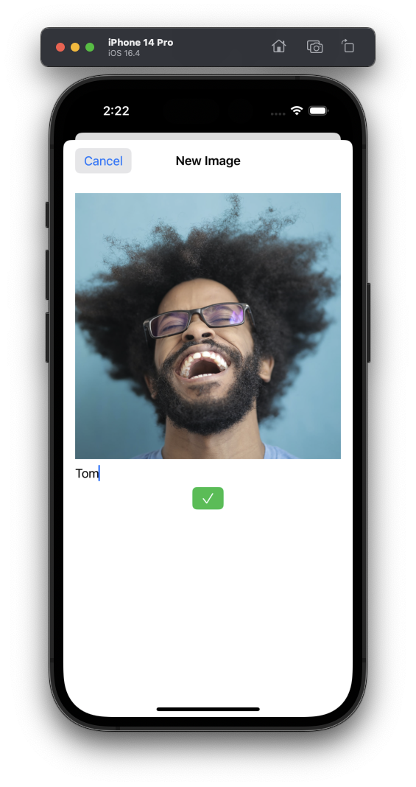

## My-Images-Core-Data
This App will demonstrate how you can save image in documents directory when your persitence layer is CoreData.

- Add Image with PhotoPicker
- Save/Update image in document directory
- Save image name in CoreData
- Delete the image and the name

## Screenshots

  
  
  

#### By Stewart Lynch
https://www.youtube.com/watch?v=O8L1h1BiO8g&t=0s
